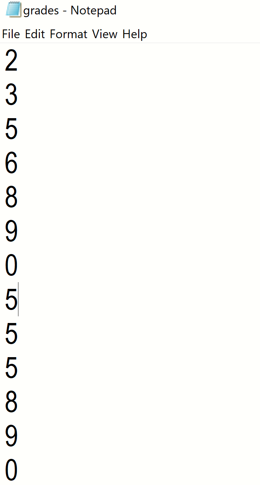

# dmst-Java-courses-assignments

__First assigment__

The purpose of this assignment is to get familiar with built automation tools and some Java libraries. 

More precisely, I created a Java-based project with Maven. This progamme reads grades from a given file and presents a histoggram with the frequencies.

An example:

Let's say that I give the following grades.txt (there are more grades in the txt).

Then the output would be like this:

