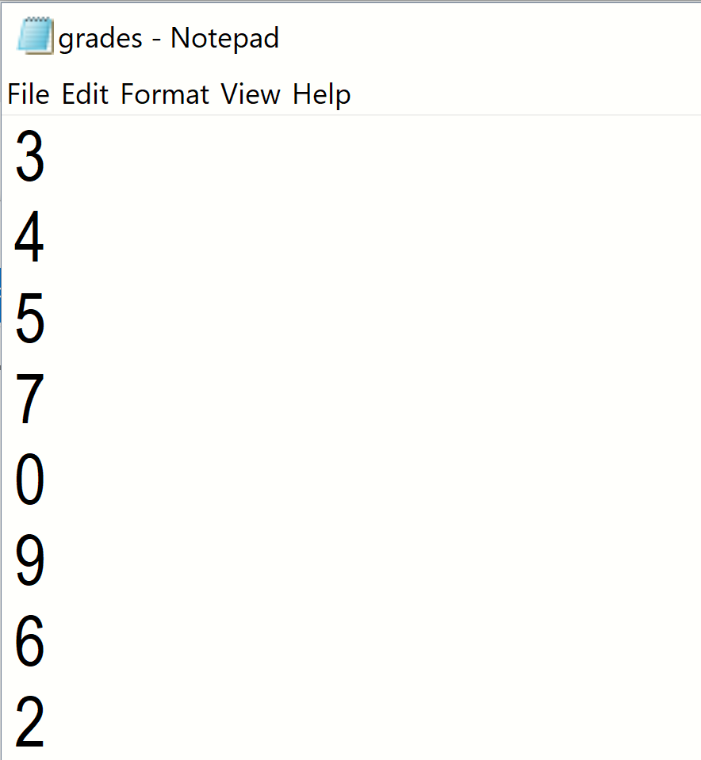
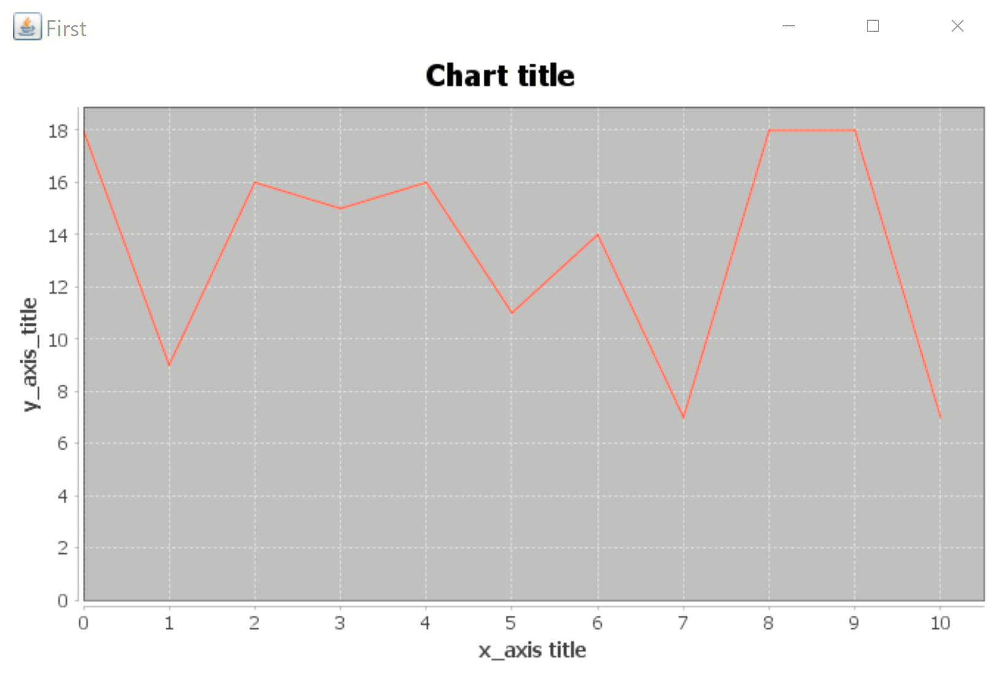

<div align="center">

<h1> 1st Assignment<br/><sub>Java lab assignments 2019</sub></h1>
</div>


The purpose of this assignment is to get familiar with built automation tools and some Java libraries. More precisely, I created a Java-based project with Maven. This progamme reads grades from a given file and presents a histogram with the frequencies.

## Requirements

``` Java 1.8.120 ``` ,
``` Apache.maven-3.6.0 ``` 

## Getting started

In order to build the project run: 

``` mvn compile package ```

Go to target directory and run:

``` java -jar gradeshistogram-0.0.1-SNAPSHOT-jar-with-dependencies <path/grades.txt> ```

## Example


Let's say that I give the following grades.txt : 




Then the output would be like this:



## Built

* **Maven** - Dependency Management

## Authors

* Marietta Lazana

## Mentor

* Antonis Gkortzis

## License

MIT license


